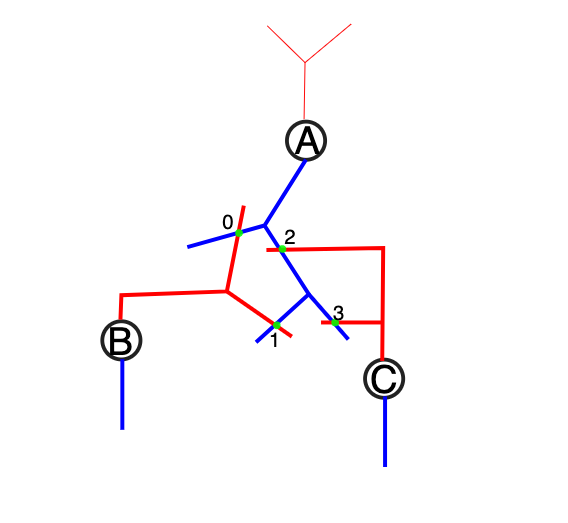

.. _sonata_population:
.. |bbp| replace:: `BBP`

SONATA Population
=================

To distinguish between nodes and edges contained or connecting different
brain parts, we will use populations, as per the `SONATA` specification.
For simplicity, it is recommended to save each population in a separate
file.

Naming
------

The following shows the naming adapted in |bbp|.

Nodes
~~~~~

For `nodes`, the following naming scheme is proposed::

    /nodes/${part}_${type}

Where ``${part}`` may be `NCX` for the neocortex, and ``${type}`` can
presently take the following values:

- `neurons`
- `astrocytes`
- `projections`

Examples::

    /nodes/thalamus_astrocytes
    /nodes/thalamus_neurons
    /nodes/ncx_astrocytes
    /nodes/ncx_neurons
    /nodes/hippocampus_projections

Edges
~~~~~

Connectivity between these populations is directional, and edges will be
contained in populations specifying `source` and `target` node populations
as well as connection type::

    /edges/${source_population}__${target_population}__${connection_type}

.. note::  The naming uses double underscores!

If the `source` and `target` node population are identical, a single edge population can be used.
In this particular usecase the edge population is bi-directional.

Currently, the following connection types are supported:

``electrical``
   this includes gap junctions for instance.
``chemical_synapse``
   this would include the following possible subtypes: glutamatergic, gabaergic, dopaminergic, serotinergic, adrenergic
``synapse_astrocyte``
   this manages the connection from an astrocyte to a particular synapse
``endfoot``
   this manages the connection between a vasculature and an astrocyte

Examples::

    /edges/thalamus_neurons__ncx_neurons__chemical_synapse

Single/Multi Populations
------------------------

In this subsection the Single-Population and Multi-Population setups are explained.
We will use the following example setup with 3 nodes (A, B and C) and 4 edges (0,1,2 and 3).

Each population in the sonata file contains a list of `fields`, which describe e.g the position of a node, it's morphological type etc.

Single Population
~~~~~~~~~~~~~~~~~

The `Nodes` are described in a single population ``SingleNodePop``:

.. code-block::

    /nodes/SingleNodePop/0/
        node_id (index) | morphology
        0               | A
        1               | B
        2               | C

and the `edges` as well in a single population `SingleNodePop`:

.. code-block::

    /edges/SingleEdgePop/
        edge_id (index) | source_node_id        | target_node_id        | 0/[attributes]
                        | attr: 'SingleNodePop' | attr: 'SingleNodePop' |
        0               | 0                     | 1                     | ...     <- synapse 0
        2               | 0                     | 1                     | ...     <- synapse 1
        3               | 0                     | 2                     | ...     <- synapse 2
        4               | 0                     | 2                     | ...     <- synapse 3

Here, the entries ``source_node_id`` and ``target_node_id`` are lists of node_id's,
and each of them contain an attribute ``attr`` - in this case the text ``SingleNodePop``.

Multi Population
~~~~~~~~~~~~~~~~

Here, the `Nodes` are described in different populations:

.. code-block::

    /nodes/OnlyA/0/
        node_id (index) | morphology
        0               | A

    /nodes/OnlyB/0/
        node_id (index) | morphology
        0               | B

    /nodes/OnlyC/0/
        node_id (index) | morphology
        0               | C

and so are the `Edges`:

.. code-block::

    /edges/A__B/
        edge_id (index) | source_node_id | target_node_id | 0/[attributes]
                        | attr: 'OnlyA'  | attr: 'OnlyB'  |
        0               | 0              | 0              | ...     <- synapse 0
        1               | 0              | 0              | ...     <- synapse 1

    /edges/A__C/
        edge_id (index) Index | source_node_id | target_node_id | 0/[attributes]
                        | attr: 'OnlyA'  | attr: 'OnlyC'  |
        0               | 0              | 0              | ...      <- synapse 2
        1               | 0              | 0              | ...      <- synapse 3

Again, the entries ``source_node_id`` and ``target_node_id`` are lists of node_id's.
But now, each population has different attributes ``attr`` for the entries ``source_node_id``
and ``target_node_id``, referring to the node population the node-id's are taken from.

If you have :math:`n` different node populations, and each population would be connected with
each other population, you need :math:`n^2` edge populations (as they are unidirectional, and you can have
intra connections inside the node populations).

Groups
------

As per the `SONATA` specification it is possible to define several node groups, but within BBP we restrict to a single group ``0``.
Therefore, the fields ``node_group_id`` and ``node_group_index`` are **not used**.