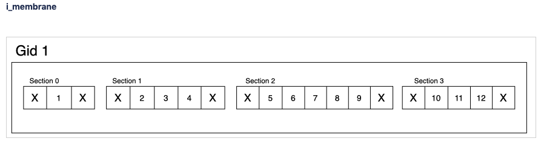
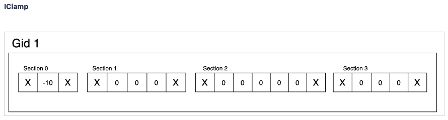

.. _report:

SONATA reports
==============

The goal of this document is to clarify the specification with respect to BBP needs.
The original report documentation is `located here <https://github.com/AllenInstitute/sonata/blob/master/docs/SONATA_DEVELOPER_GUIDE.md#output-file-formats>`_

.. _sonata_spike_files:

Spike file
----------

Spikes are currently supported on the following model_type: ``biophysical``, ``point_neuron``.

.. table::

    ========================== ================== ========== ============= =========================================================================================
    Group                      Field              Type       Requirement   Description
    ========================== ================== ========== ============= =========================================================================================
    /spikes/{population_name}  timestamps         float64    Mandatory     The time when the spike is happening.
                                                                           Units is defined by the ``units`` attribute.
    /spikes/{population_name}  node_ids           uint64     Mandatory     The node id of the cell spiking
    ========================== ================== ========== ============= =========================================================================================

The population_name group has an HDF5 attribute ``sorting``.
Possible values are ``none``, ``by_id``, ``by_time``, note that this is an `HDF5 enum: <https://support.hdfgroup.org/HDF5/doc/H5.user/DatatypesEnum.html>`_
The default order is ``by_time``.

The i-th value of timestamps is a spike of the i-th node id cell in node_ids.

The ``timestamps`` dataset has a ``units`` attribute defining the unit of the timestamp.
Only ``ms`` is supported.

Frame oriented, element recordings
----------------------------------

Compartment report
^^^^^^^^^^^^^^^^^^

.. table::

    =================================== ================== ========== ============= =========================================================================================
    Group                               Field              Type       Requirement   Description
    =================================== ================== ========== ============= =========================================================================================
    /report/{population_name}           data               float32    Mandatory     The reported values.
                                                                                    Units is defined by the ``units`` attribute.
    /report/{population_name}/mapping   node_ids           uint64     Mandatory     The set of node ids (no duplicate).
    /report/{population_name}/mapping   index_pointers     uint64     Mandatory     The offset for each node in the data field.
    /report/{population_name}/mapping   element_ids        uint32     Mandatory     Represent the compartments as in NEURON, ordered
                                                                                    by compartment IDs and grouped by nodes.
                                                                                    For the 'lfp' report type, it represent the electrode IDs.
    /report/{population_name}/mapping   time               float64    Mandatory     3 values defining start time, end time, and time step.
                                                                                    end time is not part of the report.
    =================================== ================== ========== ============= =========================================================================================

For a node node_ids[i], the data for all the recorded elements is determined by data[index_pointer[i]: index_pointer[i + 1]].
Therefore the length of index_pointer is the length of node_ids + 1 (as opposed to the shape define in the SONATA repository)

``element_pos`` has mentioned in the SONATA paper is not supported at BBP.

The ``data`` field has a hdf5 attribute ``units`` of type string.
Hardcoded to ``mV`` for now at the BBP.

The ``node_ids`` field has an optional hdf5 attribute ``sorted`` of type uint8 (different from SONATA spec).
Default is 0 for not sorted.
This field is not implemented.

The ``time`` field has a property ``units`` of type string.
Hardcoded to ``ms``.

For a full compartment reports, you need to specify both ``"sections": "all"`` and ``"compartments": "all"`` in the configuration::

    "reports": {
        "full_compartment_report": {
            "cells": "Mosaic",
            "sections": "all",        # Report all sections
            "compartments": "all",    # Include all compartments
            "type": "compartment",
            "variable_name": "v",
            "unit": "mV",
            "dt": 0.1,
            "start_time": 0,
            "end_time": 1000
        }
    }

Soma report
^^^^^^^^^^^

"Soma" report is a special case of compartment report where only the values for 1 compartment of the cell are reported. It can be reported at the soma or in the axon initial segment (AIS) depending on the configuration. In the case of multiple compartments for the soma or the axon, the one in the middle is used (as the split is an odd number).
The element_ids are always 0.

For soma reports, you need to specify ``"sections": "soma"`` in the configuration.

Summation report
^^^^^^^^^^^^^^^^

Summation report is similar to a compartment report. It usually reports a membrane current in nA (although the ``units`` field says mV).

The report uses ALU (Arithmetic Logic Unit) objects to sum multiple variables during simulation runtime.

Supported Variables
~~~~~~~~~~~~~~~~~~~

The report can handle various current sources:

* ``IntrinsicCurrents``: Channel-based currents (e.g., ina, ik, ica, i_membrane)
* ``SynapticCurrents``: All synaptic currents
* Individual current names examples:
    * Intrinsic: ``ina``, ``ik``, ``ica``, ``i_pas``, ``i_cap``, ``icsa_csa``, ``ihcn_Ih``, ``i_membrane``
    * Synaptic: ``ProbAMPANMDA_EMS``, ``ProbGABAA_EMS``
    * Stimulus: ``IClamp``, ``SEClamp``

For summation reports, you need to specify ``"type": "summation"`` in the configuration::

    "reports": {
      "cell_imembrane": {
         "cells": "Column",
         "variable_name": "i_membrane,IClamp",  # Multiple variables to sum
         "sections": "soma",                    # Or "all" for different behavior
         "type": "summation",
         "unit": "nA",
         "dt": 0.1,
         "start_time": 0,
         "end_time": 1000
       },
      "synaptic_current": {
         "cells": "Column",
         "variable_name": "ProbAMPANMDA_EMS.i",
         "sections": "all",
         "type": "summation",
         "unit": "nA",
         "dt": 0.1,
         "start_time": 0,
         "end_time": 1000
       }
    }

Reporting Behavior
~~~~~~~~~~~~~~~~~~

The summation behavior changes based on the "sections" parameter:

**Cell Target** (``"sections": "soma"``)
    The currents are summed across the entire cell but stored in a single value at the soma.

    - Compartment ids: ``[0]`` (stored in soma)
    - Data: ``[68]`` (sum of all compartments: 1-10+2+3+4+5+6+7+8+9+10+11+12)
    - Use case: When you need the total current across the entire cell as a single value

**Compartment Target** (``"sections": "all"``)
    The currents are summed per compartment and kept separate.

    - Compartment ids: ``[0, 1, 1, 1, 2, 2, 2, 2, 2, 3, 3, 3]``
    - Data: ``[-9, 2, 3, 4, 5, 6, 7, 8, 9, 10, 11, 12]``
    - Use case: When you need to analyze current distribution across the morphology

Important Notes:

* Variables are summed during simulation runtime
* Multiple current sources can be combined in a single report
* The report uses the same HDF5 structure as compartment reports

Synapse report
^^^^^^^^^^^^^^

A specialized report for monitoring synaptic dynamics and plasticity. The report structure uses:

* ``element_ids``: Individual synapse identifiers (no specific ordering)
* ``node_ids``: Identifiers of the post-synaptic cells.

Primary Use Cases:

* STDP (Spike-Timing-Dependent Plasticity) analysis
* Tracking synaptic weight changes
* Monitoring synaptic conductance
* Studying network plasticity

For STDP weight tracking, the report targets weight adjuster point processes rather than synapses directly. These processes are specialized components that handle the monitoring and modification of synaptic weights during plasticity.
By targeting these processes instead of the synapses themselves, the report can efficiently track only plastic synapses while maintaining direct access to weight changes without impacting synaptic transmission performance.

For synapse reports, you need to specify ``"type": "synapse"`` in the configuration. Note that ``"sections": "all"`` must be included to capture synapses on all compartments; otherwise, only somatic synapses will be reported::

    "reports": {
        "synapse_weights": {
            "cells": "Column",
            "type": "synapse",
            "variable_name": "StdpWADoublet.weight",
            "sections": "all",
            "unit": "nS",
            "dt": 0.1,
            "start_time": 0,
            "end_time": 1000
        },
        "exc_conductances": {
            "cells": "AllCompartments",
            "type": "synapse",
            "variable_name": "ProbAMPANMDA_EMS.g",
            "sections": "all",
            "unit": "nA",
            "dt": 0.1,
            "start_time": 0.025,
            "end_time": 100
        }
    }

LFP report
^^^^^^^^^^

A specialized report for recording Local Field Potentials (LFPs) that captures the aggregate electrical activity of neural populations. The report structure uses:

* ``element_ids``: Electrode identifiers defined in the electrodes_file (:ref:`sonata_tech`)
* ``node_ids``: Identifiers of the contributing cells

LFP reports require pre-calculated weight file (or electrodes file) that define the contribution of each compartment to the LFP signal at each electrode position.

For lfp reports, you need to specify ``"type": "lfp"`` and ``"target_simulator": "CORENEURON"`` in the configuration::

    "target_simulator": "CORENEURON",
    "run": {
        "tstart": 0,
        ...
        "electrodes_file": "/path/to/electrodes_file.h5"  # Contains electrode positions
    }

    "reports": {
        "lfp_report": {
            "type": "lfp",
            "cells": "Mosaic",
            "variable_name": "v",
            "dt": 0.1,
            "start_time": 0.0,
            "end_time": 40.0
        }
    }

Important Notes:

* Electrode positions must be defined before simulation
* Uses same HDF5 structure as compartment reports
* element_ids correspond to electrode positions
* Commonly used for analyzing population-level activity

For more detailed information about LFP reports, please refer to the `Online LFP Calculation Documentation <https://github.com/BlueBrain/neurodamus/blob/main/docs/online-lfp.rst#online-lfp-calculation-documentation>`_.

Bloodflow report
^^^^^^^^^^^^^^^^

A particular type of compartment report for ``vasculature`` nodes. It is actually a set of 3 report files that store for each time-step 3 values per segment of the vasculature:

* radius (unit: µm)
* blood pressure (unit: µm^3.s^-1)
* blood flow (unit: g.µm^-1.s^-2)

Extracellular report
--------------------

Not supported.
