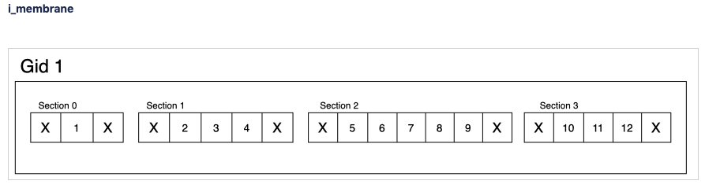
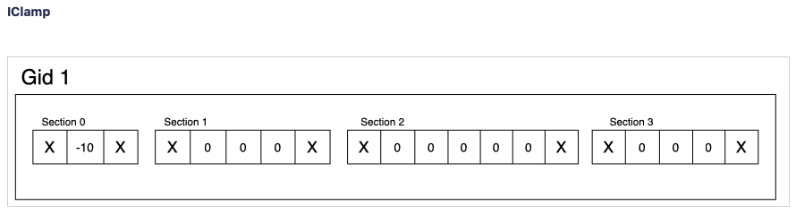

.. _sonata_simulation:

SONATA Simulation Configuration file
====================================

A simulation configuration file is a json formatted text file used for storing simulation parameters such as stimulus to drive activity, reports to collect data during run, and overrides to adapt the behavior according to experimental conditions and properties.

The file is broken up into separate sections detailed below.

version
-------

*Optional*.

Follows the same guidelines as in :ref:`Circuit Config Version <CircuitConfigVersion>` and shares the same version number.
The current version is |CurrentSonataConfigVersion|.

manifest
--------

*Optional*.

Variables defining paths and being used in the rest of the simulation configuration file.
A variable can be defined as:

- "." which is the path to the directory containing the simulation configuration file

- an absolute path

"." is always resolved as the directory containing the simulation configuration file even in the absence of manifest.

The manifest is only valid in its local file, e.g., the circuit manifest variables are not visible here.

network
-------

*Optional*.

A parameter specifying the path of the circuit configuration file for which the simulation should be performed. The default value is "circuit_config.json".

example::

  "network": "${BASE_DIR}/circuit_config.json"

target_simulator
----------------

*Optional*.

A parameter specifying which simulator to run. Supported values : "NEURON" and "CORENEURON". Default is "NEURON".

node_sets_file
--------------

*Optional*.

A file defining the list of nodesets applicable to the simulation and overriding the "node_sets_file" from the circuit configuration file which is specified by "network".

node_set
--------

*Optional*.

A parameter specifying the cells from which node set should be instantiated for the simulation. The absence of that property means that all (non virtual) nodes of all populations are loaded.

run
---

*Mandatory*.

Parameters defining global simulation settings. As NEURON is the engine used for simulation at BBP, find additional details about Simulation Control at https://nrn.readthedocs.io/en/latest/python/simctrl/programmatic.html

.. table::

   =============================== ========== =========== ====================================
   Property                        Type       Requirement Description
   =============================== ========== =========== ====================================
   tstop                           float      Mandatory   Simulation runs until biological time (t) reaches tstop. Given in ms.
   dt                              float      Mandatory   Duration of a single integration timestep. Given in ms.
   random_seed                     integer    Mandatory   For random sequences, seed is a positive integer added in order to give the user the capacity to change the sequences.
   spike_threshold                 integer    Optional    The spike detection threshold. A spike is detected whenever the voltage in the spike detection location goes over the spike threshold value. Default is -30mV. `NEURON specific details <https://nrn.readthedocs.io/en/latest/python/modelspec/programmatic/network/netcon.html#NetCon.threshold>`_.
   spike_location                  text       Optional    The spike detection location. Can be either ‘soma’ or 'AIS' for detecting spikes in either the soma or axon initial segment, respectively. Default is 'soma'.
   integration_method              text       Optional    Selects the NEURON/CoreNEURON `integration method <https://nrn.readthedocs.io/en/latest/python/simctrl/programmatic.html#secondorder>`_. This parameter sets the NEURON global variable h.secondorder. The allowed values are ‘0’ (default) for fully implicit backward euler, ‘1’ for Crank-Nicolson and ‘2’ for Crank-Nicolson with fixed ion currents.
   stimulus_seed                   integer    Optional
   ionchannel_seed                 integer    Optional
   minis_seed                      integer    Optional
   synapse_seed                    integer    Optional
   =============================== ========== =========== ====================================

example::

  "run": {
       "tstop": 1000,
       "dt": 0.025,
       "random_seed": 201506,
       "spike_location": "AIS",
       "integration_method" : 2
  }

output
------

*Optional*.

Parameters to override simulation output.

.. table::

   =============================== ========== =========== ====================================
   Property                        Type       Requirement Description
   =============================== ========== =========== ====================================
   output_dir                      text       Optional    Location where output files should be written, namely spikes and reports. Relative paths are interpreted relative to location of simulation_config. Default is relative path 'output'.
   log_file                        text       Optional    Specify the filename where console output is written. Default is STDOUT. (When using BBP machines, slurm will capture STDOUT file).
   spikes_file                     text       Optional    File name where will be listed Action Potentials generated during simulation. Default is out.h5.
   spikes_sort_order               text       Optional    The sorting of the Action Potentials. Options include "none", "by_id", "by_time". BBP currently only supports "none".
   =============================== ========== =========== ====================================

example::

  "output": {
       "output_dir": "output",
       "spikes_file": "out.h5"
  }

conditions
----------

*Optional*.

Parameters defining global experimental conditions.

.. table::

   =============================== ========== =========== ====================================
   Property                        Type       Requirement Description
   =============================== ========== =========== ====================================
   celsius                         float      Optional    Temperature of experiment. Default is 34.0.
   v_init                          float      Optional    Initial membrane voltage in mV. Default is -80.
   synapses_init_depleted          boolean    Optional    Synapse at start of simulation are in depleted state. Default is false.
   extracellular_calcium           float      Optional    Extracellular calcium concentration. When this parameter is provided, apply it to the synapse uHill parameter to scale the U parameter of synapses (py-neurodamus only feature). If not specified, U is set directly as read from edges file.
   randomize_gaba_rise_time        boolean    Optional    When true, enable legacy behavior to randomize the GABA_A rise time in the helper functions. Default is false which will use a prescribed value for GABA_A rise time.
   mechanisms                                 Optional    Properties to assign values to variables in synapse MOD files.
                                                          The format is a dictionary with keys being the SUFFIX names of MOD files (unique names of mechanisms) and values being dictionaries of variable names in the MOD files and their values. Read about `NMODL2 SUFFIX description here <https://nrn.readthedocs.io/en/8.2.0/hoc/modelspec/programmatic/mechanisms/nmodl2.html#suffix>`_.
   =============================== ========== =========== ====================================

example::

  "conditions": {
       "celsius": 34.0,
       "synapses_init_depleted": false
       "mechanisms": {
           "ProbAMPANMDA_EMS": {
               "init_depleted": true,
               "minis_single_vesicle": false
           },
           "ProbGABAAB_EMS" : {
               "property_x": 1,
               "property_y": 0.25
           },
           "GluSynapse": {
               "property_z": "string"
           }
       }
  }

inputs
------

*Optional*.

Collection of dictionaries with each member describing one pattern of stimulus to be injected.

.. table::

   ============================== ========== ============ ==========================================
   Property                       Type       Requirement  Description
   ============================== ========== ============ ==========================================
   module                         text       Mandatory    The type of stimulus dictating additional parameters (see addtional tables below). Supported values: "linear", "relative_linear", "pulse", "subthreshold", "hyperpolarizing", "synapse_replay", "seclamp", "noise", "shot_noise", "relative_shot_noise", "absolute_shot_noise", "ornstein_uhlenbeck", "relative_ornstein_uhlenbeck".
   input_type                     text       Mandatory    The type of the input with the reserved values : "spikes", "extracellular_stimulation", "current_clamp", "voltage_clamp", "conductance". Should correspond according to the module (see additional tables below). Currently, not validated by BBP simulation which will use the appropriate input_type regardless of the string passed.
   delay                          float      Mandatory    Time in ms when input is activated.
   duration                       float      Mandatory    Time duration in ms for how long input is activated.
   node_set                       text       Mandatory    Node set which is affected by input.
   ============================== ========== ============ ==========================================

Below are additional parameters used depending on the module (input_type)

linear (current_clamp)
~~~~~~~~~~~~~~~~~~~~~~

A continuous injection of current.

.. table::

   ============================== ========== ============ ==========================================
   Property                       Type       Requirement  Description
   ============================== ========== ============ ==========================================
   amp_start                      float      Mandatory    The amount of current initially injected when the stimulus activates. Given in nA.
   amp_end                        float      Optional     If given, current is interpolated such that current reaches this value when the stimulus concludes. Otherwise, current stays at amp_start. Given in nA.
   ============================== ========== ============ ==========================================

relative_linear (current_clamp)
~~~~~~~~~~~~~~~~~~~~~~~~~~~~~~~

A continues injection of current, regulated according to the current a cell requires to reach threshold.

.. table::

   ============================== ========== ============ ==========================================
   Property                       Type       Requirement  Description
   ============================== ========== ============ ==========================================
   percent_start                  float      Mandatory    The percentage of a cell's threshold current to inject when the stimulus activates.
   percent_end                    float      Optional     If given, The percentage of a cell's threshold current is interpolated such that the percentage reaches this value when the stimulus concludes. Otherwise, stays at percent_start.
   ============================== ========== ============ ==========================================

pulse (current_clamp)
~~~~~~~~~~~~~~~~~~~~~

Series of current pulse injections.

.. table::

   ============================== ========== ============ ==========================================
   Property                       Type       Requirement  Description
   ============================== ========== ============ ==========================================
   amp_start                      float      Mandatory    The amount of current initially injected when each pulse activates. Given in nA.
   amp_end                        float      Optional     If given, current is interpolated such that current reaches this value when the stimulus concludes. Otherwise, current stays at amp_start. Given in nA.
   width                          float      Mandatory    The length of time each pulse lasts. Given in ms.
   frequency                      float      Mandatory    The frequency of pulse trains. Given in Hz.
   ============================== ========== ============ ==========================================

subthreshold (current_clamp)
~~~~~~~~~~~~~~~~~~~~~~~~~~~~

A continuous injections of current, adjusted from the current a cell requires to reach threshold.

.. table::

   ============================== ========== ============ ==========================================
   Property                       Type       Requirement  Description
   ============================== ========== ============ ==========================================
   percent_less                   integer    Mandatory    A percentage adjusted from 100 of a cell's threshold current. E.g. 20 will apply 80% of the threshold current. Using a negative value will give more than 100. E.g. -20 will inject 120% of the threshold current.
   ============================== ========== ============ ==========================================

hyperpolarizing (current_clamp)
~~~~~~~~~~~~~~~~~~~~~~~~~~~~~~~

A hyperpolarizing current injection which brings a cell to base membrance voltage used in experiments.
Note: No additional parameter are needed when using module "hyperpolarizing". The holding current applied is defined in the cell model.

.. table::

   ============================== ========== ============ ==========================================
   Property                       Type       Requirement  Description
   ============================== ========== ============ ==========================================
   N/A                            N/A        N/A          N/A
   ============================== ========== ============ ==========================================

synapse_replay (spikes)
~~~~~~~~~~~~~~~~~~~~~~~

Spike events are created from the cells indicated in a file and delivered to their post synaptic targets. The weights of the replay synapses are set at t=0 ms and are not altered by any delayed connection.

.. table::

   ============================== ========== ============ ==========================================
   Property                       Type       Requirement  Description
   ============================== ========== ============ ==========================================
   spike_file                     text       Mandatory    Indicates the location of the file with the spike info for injection.
   source                         text       Optional     The node set to replay spikes from.
   ============================== ========== ============ ==========================================

seclamp (voltage_clamp)
~~~~~~~~~~~~~~~~~~~~~~~

Cells are held at indicated membrane voltage by injecting adapting current.

.. table::

   ============================== ========== ============ ==========================================
   Property                       Type       Requirement  Description
   ============================== ========== ============ ==========================================
   voltage                        float      Mandatory    Specifies the membrane voltage the targeted cells should be held at in mV.
   rs                             float      Optional     Specifies the series resistance in Mohm. Default is 0.01 Mohm.
   ============================== ========== ============ ==========================================

noise (current_clamp)
~~~~~~~~~~~~~~~~~~~~~

Continuous injection of current with randomized deflections.
Note: one must chose either "mean" or "mean_percent".

.. table::

   ============================== ========== ============ ==========================================
   Property                       Type       Requirement  Description
   ============================== ========== ============ ==========================================
   mean                           float      Mandatory*   The mean value of current to inject. Given in nA.
   mean_percent                   float      Mandatory*   The mean value of current to inject as a percentage of a cell's threshold current.
   variance                       float      Optional     The variance around the mean of current to inject using a normal distribution.
   ============================== ========== ============ ==========================================

example::

  "inputs": {
       "threshold_exc": {
            "module": "noise",
            "input_type": "current_clamp",
            "mean_percent": 78,
            "variance": 0.1,
            "delay": 500,
            "duration": 3000,
            "node_set": "L5TTPC"
       }
  }

shot_noise, absolute_shot_noise and relative_shot_noise (current_clamp or conductance)
~~~~~~~~~~~~~~~~~~~~~~~~~~~~~~~~~~~~~~~~~~~~~~~~~~~~~~~~~~~~~~~~~~~~~~~~~~~~~~~~~~~~~~

Generate a Poisson shot noise signal consisting of bi-exponential pulses with gamma distributed amplitudes occurring at exponentially distributed time intervals, resembling random synaptic input. In the Relative and Absolute versions the three parameters (rate, amp_mean, amp_var) are obtained from other three parameters: (amp_cv, mean_percent, sd_percent) for Relative and (amp_cv, mean, sigma) for Absolute, through and analytical result that connects them. In the Relative version the parameters (mean, sigma) are computed relative to a cell's threshold current (current_clamp) or inverse input resistance (conductance), by scaling these with (mean_percent, sd_percent).
The input resistance values must be provided as an additional dataset ``@dynamics/input_resistance`` in the nodes file.
Note: fields marked Mandatory* depend on which shot_noise version is selected.

.. table::

   ============================== ========== ============ ==========================================
   Property                       Type       Requirement  Description
   ============================== ========== ============ ==========================================
   rise_time                      float      Mandatory    The rise time of the bi-exponential shots in ms.
   decay_time                     float      Mandatory    The decay time of the bi-exponential shots in ms.
   rate                           float      Mandatory*   For shot_noise, rate of Poisson events in Hz.
   amp_mean                       float      Mandatory*   For shot_noise, mean of gamma-distributed amplitudes in nA (current_clamp) or uS (conductance).
   amp_var                        float      Mandatory*   For shot_noise, variance of gamma-distributed amplitudes in nA^2 (current_clamp) or uS^2 (conductance).
   amp_cv                         float      Mandatory*   For relative_shot_noise and absolute_shot_noise, coefficient of variation (sd/mean) of gamma-distributed amplitudes.
   mean_percent                   float      Mandatory*   For relative_shot_noise, signal mean as percentage of a cell's threshold current (current_clamp) or inverse input resistance (conductance).
   sd_percent                     float      Mandatory*   For relative_shot_noise, signal std dev as percentage of a cell's threshold current (current_clamp) or inverse input resistance (conductance).
   mean                           float      Mandatory*   For absolute_shot_noise, signal mean in nA (current_clamp) or uS (conductance).
   sigma                          float      Mandatory*   For absolute_shot_noise, signal std dev in nA (current_clamp) or uS (conductance).
   dt                             float      Optional     Timestep of generated signal in ms. Default is 0.25 ms.
   random_seed                    integer    Optional     Override the random seed (to introduce correlations between cells).
   ============================== ========== ============ ==========================================

ornstein_uhlenbeck and relative_ornstein_uhlenbeck (current_clamp or conductance)
~~~~~~~~~~~~~~~~~~~~~~~~~~~~~~~~~~~~~~~~~~~~~~~~~~~~~~~~~~~~~~~~~~~~~~~~~~~~~~~~~
Generate an `Ornstein-Uhlenbeck process <https://en.wikipedia.org/wiki/Ornstein%E2%80%93Uhlenbeck_process>`_ signal injected as a conductance or current. In the Relative version the parameters (mean, sigma) are computed relative to a cell's inverse input resistance (conductance) or threshold current (current_clamp), by scaling these with (mean_percent, sd_percent).
The input resistance values must be provided as an additional dataset ``@dynamics/input_resistance`` in the nodes file.
Note: fields marked Mandatory* depend on which ornstein_uhlenbeck version is selected.

.. table::

   ============================== ========== ============ ==========================================
   Property                       Type       Requirement  Description
   ============================== ========== ============ ==========================================
   tau                            float      Mandatory    Relaxation time constant in ms.
   mean_percent                   float      Mandatory*   For relative_ornstein_uhlenbeck, signal mean as percentage of a cell's threshold current (current_clamp) or inverse input resistance (conductance).
   sd_percent                     float      Mandatory*   For relative_ornstein_uhlenbeck, signal std dev as percentage of a cell's threshold current (current_clamp) or inverse input resistance (conductance).
   mean                           float      Mandatory*   For ornstein_uhlenbeck, signal mean in nA (current_clamp) or uS (conductance).
   sigma                          float      Mandatory*   For ornstein_uhlenbeck, signal std dev in nA (current_clamp) or uS (conductance).
   reversal                       float      Optional     Reversal potential for conductance injection in mV. Default is 0.
   dt                             float      Optional     Timestep of generated signal in ms. Default is 0.25 ms.
   random_seed                    integer    Optional     Override the random seed (to introduce correlations between cells).
   ============================== ========== ============ ==========================================

reports
-------

*Optional*.

Collection of dictionaries with each member describing one data collection during the simulation such as compartment voltage.

.. table::

   ============================== ========== ============ ==========================================
   Property                       Type       Requirement  Description
   ============================== ========== ============ ==========================================
   cells                          text       Optional     Specify which node_set to report, default is the simulation "node_set".
   sections                       text       Optional     Specify which section(s) to report, available labels are dependent on the model setup. To report on all sections, use the keyword "all". Default is "soma". At BBP, we currently support "soma", "axon", "dend", "apic", or "all".
   type                           text       Mandatory    Indicates type of data collected. "compartment", "summation", or "synapse". Compartment means that each compartment outputs separately in the report file. Summation will sum up the values from compartments to write a single value to the report (section soma) or sum up the values and leave them in each compartment (other section types). More on summation after the table. Synapse indicates that each synapse afferent to the reported cells will have a separate entry in the report.
   scaling                        text       Optional     For summation type reporting, specify the handling of density values: "none" disables all scaling, "area" (default) converts density to area values. This makes them compatible with values from point processes such as synapses.
   compartments                   text       Optional     For compartment type reporting, override which compartments of a section are selected to report. Options are "center" or "all". When using "sections":"soma", default is "center", for other section options, default is "all".
   variable_name                  text       Mandatory    The Simulation variable to access. The variables available are model dependent. For summation type, can sum multiple variables by indicating as a comma separated strings. e.g. "ina", "ik"
   unit                           text       Optional     String to output as descriptive test for unit recorded. Not validated for correctness.
   dt                             float      Mandatory    Interval between reporting steps in milliseconds. If assigned value smaller than simulation dt, will be set equal to simulation dt.
   start_time                     float      Mandatory    Time to start reporting in milliseconds.
   end_time                       float      Mandatory    Time to stop reporting in milliseconds.
   file_name                      text       Optional     Specify file name, otherwise takes the form <repname>_SONATA.h5. If '.h5' extension is not included, it will be added.
   enabled                        boolean    Optional     Allows for supressing a report so that it is not created. Useful for reducing output temporarily. Possible values are true/false. Default is true.
   ============================== ========== ============ ==========================================

More on type summation
~~~~~~~~~~~~~~~~~~~~~~

This type of report is intended to accommodate related variables that exist in a section. For example, various electrical current sources.
Depending on the sections value, the behavior of the summation adapts. Given "soma", the values are summed across the whole cell and stored as a single value. For other sections value (e.g. "all"), values are only summed within the same compartment and stored per compartment.

If the user has requested summation with sections soma, then the resultant single value written is [68]. Computed from (1 -10 +2+3+4+5+6+7+8+9+10+11+12).

If the user has requested summation with sections all, then the resultant data is [-9, 2, 3, 4, 5, 6, 7, 8, 9, 10, 11, 12 ]. Computed from (1-10, 2+0, 3+0, etc.)

example::

  "reports": {
       "soma": {
            "cells": "Mosaic",
            "sections": "soma",
            "type": "compartment",
            "variable_name": "v",
            "unit": "mV",
            "dt": 0.1,
            "start_time" : 0,
            "end_time" : 500,
            "file_name": "soma"
            "enabled" : true
       },
       "compartment": {
            "cells": "Mosaic",
            "sections": "all",
            "type": "compartment",
            "variable_name": "v",
            "unit": "mV",
            "dt": 0.1,
            "start_time" : 0,
            "end_time" : 500,
            "file_name": "voltage"
            "enabled" : true
       },
       "axonal_comp_centers": {
            "cells": "Mosaic",
            "sections": "axon",
            "type": "compartment",
            "variable_name": "v",
            "unit": "mV",
            "compartments": "center",
            "dt": 0.1,
            "start_time" : 0,
            "end_time" : 500,
            "file_name": "axon_centers"
            "enabled" : true
       },
       "cell_imembrane": {
           "cells": "Column",
           "sections": "soma",
           "type": "summation",
           "variable_name": "i_membrane", "IClamp",
           "unit": "nA",
           "start_time": 0,
           "end_time": 500,
           "enabled": true
       }
  }

connection_overrides
--------------------

*Optional*.

Collection of dictionaries to adjust the synaptic strength or other properties of edges between two sets of nodes. These are executed in the order they are read from the file. If a set of synapses are affected by multiple connection_overrides because of source and target used, the latter will overwrite any repeated fields set by a former. This is useful when making more general adjustments and then more specific adjustments. Any edges unaffected by any connection_overrides are instantiated as prescribed in the model.

.. table::

   ============================== ========== ============ ==========================================
   Property                       Type       Requirement  Description
   ============================== ========== ============ ==========================================
   source                         text       Mandatory    node_set specifying presynaptic nodes.
   target                         text       Mandatory    node_set specifying postsynaptic nodes.
   weight                         float      Optional     Scalar used to adjust synaptic strength.
   spont_minis                    float      Optional     Synapses affected by this connection_override section will spontaneously trigger with the given rate.
   synapse_configure              text       Optional     Provide a snippet of hoc code which is to be executed on the synapse objects affected by this connection_override. Use '%s' to indicate where a reference to the synapse object should be filled.
   modoverride                    text       Optional     Changes the synapse helper files used to instantiate the synapses in this connection. A synapse helper initializes the synapse object and the parameters of the synapse model. By default, AMPANMDAHelper.hoc / GABAABHelper.hoc are used for excitatory / inhibitory synapses. The value of this field determines the prefix of the helper file to use e.g. "Newfun" would lead to NewfunHelper.hoc being used. Exceptionally, passing "GluSynapse" will lead to GluSynapse.hoc being used. That helper will use the additional parameters of the plastic synapse model read from the SONATA edges file using Neurodamus. This is required when using the GluSynapse.mod model and will fail for other models, or if the parameters are not present in the edges file.
   synapse_delay_override         float      Optional     Value to override the synaptic delay time originally set in the edge file, and to be given to netcon object. Given in ms.
   delay                          float      Optional     Adjustments from weight of this connection_override are applied after specified delay has elapsed in ms. Note that only weight modifications are applied so all other fields (spont_minis, synapse_configure, modoverride, synapse_delay_override) are ignored.
   ============================== ========== ============ ==========================================

example::

  "connection_overrides": {
       "weaken_excitation": {
            "source": "Excitatory",
            "target": "Mosaic,
            "weight": 0.75,
            "spont_minis": 0.04
       },
       "deactivate_short_term_plasticity": {
            "source": "Mosaic",
            "target": "Mosaic",
            "synapse_configure": "%s.Fac = 0 %s.Dep = 0"
  }
