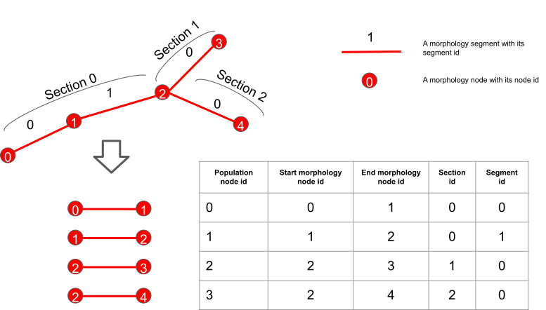

.. _sonata_tech:

SONATA Technical description
============================

The following is the definition of the file format used in the SONATA file.

Sonata Files
------------

A Sonata circuit possesses multiple files which contain the different network data.
This includes at least a node file and an edge file. Each file can contain multiple populations (see below) of nodes and edges.

At BBP, we decided to use the file extension ``.h5`` for all the sonata files in HDF5 format.
That is the files that contain scientific data: the node, edge, spike report and frame report files.
This follows the official recommendations.
The configuration files are in JSON format and have the .json extension.
That is: the circuit configuration, simulation configuration and nodesets definition.

.. Warning::
   One cannot make assumption about the file name.
   As opposed to legacy CircuitConfig and BlueConfig, SONATA specification do not enforce a name for circuit and simulation configuration json files.

Even if technically possible, we decided not to mix the node and edge populations inside the same file.

The name convention for the files outputted from ``circuit-build`` is :
  - ``nodes.h5`` for the node file
  - ``edges.h5`` for the edge file

.. _node_file:

Node File
---------

Fields for Nodes
~~~~~~~~~~~~~~~~

The fields for the nodes depend on the `model_type` of the node, which should be stored in the sonata config file in as per :ref:`Sonata Node Types <sonata_config_node_type>`

Some properties can be stored in a `@library` group for more efficient storage use.
These attributes ``/<population>/<group>/X`` are stored as an integer that maps to a corresponding attribute in ``/<population>/<group>/@library/X``.

.. As per ``SONATA`` specification, these values should be stored as integer values and be resolved to strings.

Fields for biophysically detailed neurons (model_type: `biophysical`)
~~~~~~~~~~~~~~~~~~~~~~~~~~~~~~~~~~~~~~~~~~~~~~~~~~~~~~~~~~~~~~~~~~~~~

.. _biophysical_node_type:

Group column represents the HDF group where the dataset is located under /<population>. "/" means it is directly under /<population>.

.. table::

    ================== =============================== ========== ============= =========================================================================================
    Group              Field                           Type       Requirement   Description
    ================== =============================== ========== ============= =========================================================================================
    /0                 ``x``, ``y``, ``z``             float32    Mandatory     The position of the center of the soma in the local world in µm.
    /0                 ``rotation_angle_[x|y|z]axis``  float32    Optional      Euler angle representation of the rotation around the given axis of the morphology around the soma in radians.
    /0                 ``orientation_[w|x|y|z]``       float32    Mandatory     Preferred way to define the rotation as quaternions.
                                                                                Note: **the quaternions are not guaranteed to be normalized**
    /0                 ``morphology``                  utf8       Mandatory     Morphology file relative path, without file extension.
                                                                                Example "mymorphology" or "mypath/mymorphology".
                                                                                The file format may be different depending on the consumer.
    /0                 ``layer``                       utf8       Optional?     Layer for the neuron.
    /0                 ``model_template``              utf8       Mandatory     See details below.
    /0                 ``model_type``                  utf8       Mandatory     `biophysical`
    /0                 ``morph_class``                 utf8       Mandatory     Used to define the morphology classification.
                                                                                Whether they are "PYR" or "INT", for example.
    /0                 ``etype``                       utf8       Mandatory     Defines the electrical type of the node.
    /0                 ``mtype``                       utf8       Mandatory     Defines the morphological type of the node.
    /0                 ``me_combo``                    utf8       Optional      Deprecated Replaced by dynamics_params.
                                                                                Foreign key to me combo tsv file.
    /0                 ``synapse_class``               utf8       Mandatory     Defines the synapse type of the node; whether the neuron is inhibitory or excitatory. "EXC" or "INH".
    /0                 ``region``                      utf8       Optional      Attribute assigning a brain region to the associated cell.
    /0/dynamics_params ``threshold_current``           float32    Mandatory     The minimal amplitude (in nA) of a step current clamp injection that triggers an action potential.
    /0/dynamics_params ``holding_current``             float32    Mandatory     The current clamp amplitude (in nA) necessary to hold the cell at a predefined holding voltage (typically around -85 mV for BBP).
    /0/dynamics_params ``AIS_scaler``                  float32    Optional      Multiplicative factor to scale AIS (morphology dependent and optional, used only for synthesis).
    /0/dynamics_params ``input_resistance``            float32    Optional      Input resistance of the cell in MOhm.
    /0                 |minis|                         float32    Optional      Mini-frequencies are associated with incoming connections of a cell, and depend on the incoming connection's synapse type, and the receiving cell's layer.
                                                                                If the synapse type is excitatory then exc-mini_frequency is used, otherwise inh-mini_frequency is used.
                                                                                Default to the one provided by the circuit config if not present (Unit is Hz).
    /0                 ``hemisphere``                  utf8       Optional      "left" or "right" hemisphere.
    /                  ``node_type_id``                int64      Mandatory     Set to -1. Foreign key to node type csv file not used at BBP..
    ================== =============================== ========== ============= =========================================================================================

.. |minis| replace:: ``exc-mini_frequency``, ``inh-mini_frequency``

Fields for astrocyte population (model_type: `astrocyte`)
~~~~~~~~~~~~~~~~~~~~~~~~~~~~~~~~~~~~~~~~~~~~~~~~~~~~~~~~~

.. _astrocyte_node_type:

.. table::

    ================== =============================== ========== ============= =========================================================================================
    Group              Field                           Type       Requirement   Description
    ================== =============================== ========== ============= =========================================================================================
    /0                 ``x``, ``y``, ``z``             float32    Mandatory     The position of the center of the soma in the local world in µm.
    /0                 ``radius``                      float32    Mandatory     The radius of the astrocytic soma in µm.
    /0                 ``mtype``                       utf8       Mandatory     The morphological type of the astrocyte.
    /0                 ``morphology``                  utf8       Mandatory     The name of the astrocytic morphology without extension.
    /0                 ``model_type``                  utf8       Mandatory     `astrocyte` JDC: seems to be incorrect in generated files..
    /0                 ``model_template``              utf8       Mandatory     See details below.
    /0                 ``layer``                       utf8       Optional?     Layer for the neuron.
    /0                 ``region``                      utf8       Optional      Attribute assigning a brain region to the associated cell.
    /0                 ``hemisphere``                  utf8       Optional      "left" or "right" hemisphere.
    /                  ``node_type_id``                int64      Mandatory     Set to -1.
    ================== =============================== ========== ============= =========================================================================================

This type of population requires extra datasets. These datasets are represented in the sonata config file as:

    "microdomains_file": path/to/the/microdomain/tessellation

where "microdomains_file" correspond to the microdomain tessellation (See :ref:`here<microdomains>` for full description of the microdomains dataset).

Fields for vasculature population (model_type: `vasculature`)
~~~~~~~~~~~~~~~~~~~~~~~~~~~~~~~~~~~~~~~~~~~~~~~~~~~~~~~~~~~~~

.. _vasculature_node_type:

The edges/segment of the vasculature morphology are stored as a population of nodes.

Thus, the id of the vasculature population node corresponds to the i-th edge in the vascular morphology.

This representation is essential for the endfoot connection edges that require a target node which is here a particular edge of the vascular morphology.

In order, to maintain the mapping between the edge identification and the section/segment one, the section and segment ids for each edge of the vascular morphology are stored so that the section representation can be uniquely reconstructed if needed.
An edge_id is unique to a vasculature morphology, a segment_id is local to a section of a vasculature morphology.

.. table::

    ================== =============================== ========== ============= ==================================================================================================
    Group              Field                           Type       Requirement   Description
    ================== =============================== ========== ============= ==================================================================================================
    /0                 ``start_[x|y|z]``               float32    Mandatory     The coordinate of the starting point of vasculature's segment in the local world in µm.
    /0                 ``end_[x|y|z]``                 float32    Mandatory     The coordinate of the ending point of vasculature's segment in the local world in µm.
    /0                 ``start_diameter``              float32    Mandatory     The diameter of the starting point of vasculature's segment in µm.
    /0                 ``end_diameter``                float32    Mandatory     The diameter of the ending point of vasculature's segment in µm.
    /0                 ``start_node``                  uint64     Mandatory     Morphology node id of the starting point of the vasculature segment.
    /0                 ``end_node``                    uint64     Mandatory     Morphology node id of the ending point of the vasculature segment.
    /0                 ``type``                        int32      Mandatory     The edge type is an integer in the list [1, 2, 3, 4, 5, 6, 7] corresponding to vein, artery, venule, arteriole, venous-capillary, arterial-capillary, transitional.
    /0                 ``section_id``                  uint32     Mandatory     The corresponding section id in the vasculature morphology.
    /0                 ``segment_id``                  uint32     Mandatory     The corresponding segment id in the vasculature morphology.
    /0                 ``model_type``                  utf8       Mandatory     `vasculature`
    /                  ``node_type_id``                int64      Mandatory     Set to -1.
    ================== =============================== ========== ============= ==================================================================================================

This type of population requires extra datasets. These datasets are represented in the sonata config file as:

    "vasculature_mesh": path/to/the/mesh
    "vasculature_morphology": path/to/the/skeleton

The `vasculature_mesh` is the watertight representation of the vasculure produced using ``Ultralizer`` or any other tool that can produce such surface meshes.
The surface mesh's extension is  **.obj**.

Fields for point neuron population (model_type: `point_neuron`)
~~~~~~~~~~~~~~~~~~~~~~~~~~~~~~~~~~~~~~~~~~~~~~~~~~~~~~~~~~~~~~~~~

This is for AdEx point neuron models, see  Brette R. and Gerstner W. (2005) [1]_.

The equivalent NEST model is: `<https://nest-simulator.readthedocs.io/en/v3.0/models/aeif_cond_beta_multisynapse.html>`_.

.. table::

    ================== =============================== ========== ============= ==================================================================================================
    Group              Field                           Type       Requirement   Description
    ================== =============================== ========== ============= ==================================================================================================
    /0/dynamics_params ``C_m``                         float32    Mandatory     Membrane capacitance. (pF)
    /0/dynamics_params ``Delta_T``                     float32    Mandatory     Slope factor. (mV).
    /0/dynamics_params ``e_L``                         float32    Mandatory     Leak reversal potential. (mV).
    /0/dynamics_params ``i_e``                         float32    Mandatory     Constant external input current (pA).
    /0/dynamics_params ``v_peak``                      float32    Mandatory     Spike detection threshold. (mV).
    /0/dynamics_params ``v_reset``                     float32    Mandatory     Reset value for V_m after a spike. (mV).
    /0/dynamics_params ``v_th``                        float32    Mandatory     Spike initial threshol. (mV).
    /0/dynamics_params ``a``                           float32    Mandatory     Subthreshold adaptation. (nS).
    /0/dynamics_params ``b``                           float32    Mandatory     Spike triggered adaption. (pA).
    /0/dynamics_params ``g_L``                         float32    Mandatory     Leak conductance. (nS).
    /0/dynamics_params ``t_ref``                       float32    Mandatory     Duration of refractory period. (ms).
    /0/dynamics_params ``tau_w``                       float32    Mandatory     tau_w (ms). Time constant for adaptation current.
    /0/dynamics_params ``nb_receptors``                uint32     Mandatory     Number of receptors in the postsynaptic membrane
    /0/dynamics_params ``e_rev``                       float32    Mandatory     Synaptic reverse potential. (mV). ``nb_receptors`` elements. Reverse potential.
    /0/dynamics_params ``tau_decay``                   float32    Mandatory     Synaptic decay time constant (for afferent synapses). (ms) cardinality is ``nb_receptors`` elements.
    /0/dynamics_params ``tau_rise``                    float32    Mandatory     Rise time of the synaptic conductance (for afferent synapses). (ms) cardinality is ``nb_receptors`` elements.
    /0                 ``x``, ``y``, ``z``             float32    Mandatory     The position of the center of the soma in the local world in µm.
    /0                 ``etype``                       utf8       Mandatory     Electrical type of the node.
    /0                 ``mtype``                       utf8       Mandatory     Morphological type of the node.
    /0                 ``synapse_class``               utf8       Mandatory     Defines the synapse type of the node; whether the neuron is inhibitory or excitatory. "EXC" or "INH".
    /0                 ``region``                      utf8       Optional      Brain region of the cell.
    /0                 ``hemisphere``                  utf8       Optional      "left" or "right" hemisphere.
    /0                 ``model_type``                  utf8       Mandatory     `point_neuron`
    /                  ``node_type_id``                int64      Mandatory     Set to -1. Foreign key to node type csv file not used at BBP..
    ================== =============================== ========== ============= ==================================================================================================

.. rubric:: References

.. [1] Brette R. and Gerstner W. (2005), Adaptive Exponential Integrate-and-Fire Model as an Effective Description of Neuronal Activity, J. Neurophysiol. 94: 3637 - 3642.
   DOI: `<https://journals.physiology.org/doi/full/10.1152/jn.00686.2005>`__.

Fields for virtual population (model_type: `virtual`)
~~~~~~~~~~~~~~~~~~~~~~~~~~~~~~~~~~~~~~~~~~~~~~~~~~~~~

.. _virtual_node_type:

This is for `virtual` nodes (i.e., source nodes of `projections`).

.. table::

    ================== =============================== ========== ============= ==================================================================================================
    Group              Field                           Type       Requirement   Description
    ================== =============================== ========== ============= ==================================================================================================
    /0                 ``model_type``                  utf8       Mandatory     `virtual`
    /0                 ``model_template``              utf8       Mandatory     See details below.
    /                  ``node_type_id``                int64      Mandatory     Set to -1. Foreign key to node type csv file not used at BBP..
    ================== =============================== ========== ============= ==================================================================================================

model_template
~~~~~~~~~~~~~~

The ``model_template`` is used to reference a template or class describing the electrophysical properties and mechanisms of the node(s).
Its value and interpretation is context-dependent on the corresponding ‘model_type’.
When there is no applicable model template for a given model type (i.e. model_type=virtual) it is assigned a value of NULL.
Otherwise, within BBP, it uses a colon-separated string-pair with the following syntax: ``hoc:resource`` where ``resource`` is a reference to the template file-name or class.

Edge File
---------

Fields for Edges
~~~~~~~~~~~~~~~~

Fields for chemical connection type edges
~~~~~~~~~~~~~~~~~~~~~~~~~~~~~~~~~~~~~~~~~

.. _chemical_connection:

Connection type is ``chemical``.
Group column represents the HDF group where the dataset is located under /<population>. "/" means it is directly under /<population>.

.. table::

    ============= ============================= ========== =========== =========================================================================================
    Group         Field                         Type       Requirement Description
    ============= ============================= ========== =========== =========================================================================================
    /0            ``afferent_center_[x|y|z]``   float32    Mandatory   Position on the `axis` of the cell's section/segment in µm.
    /0            ``afferent_surface_[x|y|z]``  float32    Mandatory   Position on the surface of a cylindrical cell segment, radially outward from the center position in the direction of the other cell in µm.
    /0            ``afferent_section_id``       uint32     Mandatory   The specific section on the target node where a synapse is placed.
    /0            ``afferent_section_pos``      float32    Mandatory   Fractional position along the length of the section (normalized to the range [0, 1], where 0 is at the start of the section and 1 is at the end of the section).
    /0            ``afferent_section_type``     uint32     Mandatory   Neurite or soma type of the afferent as in morphIO: soma=1, axon=2, basal_dendrite=3, apical_dendrite=4.
    /0            ``afferent_segment_id``       uint32     Mandatory   Numerical index of the section of the cell (soma is index 0).
    /0            ``afferent_segment_offset``   float32    Mandatory   If triple synapse addressing is being used, the offset within the segment in um.  See :ref:`faq`.
    /0            ``efferent_center_[x|y|z]``   float32    Mandatory   Same as ``afferent_center_[x|y|z]``, but for the synapse position at the axon of the presynaptic cell.
    /0            ``efferent_surface_[x|y|z]``  float32    Mandatory   Same as ``efferent_center_[x|y|z]``, but the for the synapse location on the axon surface.
    /0            ``efferent_section_id``       uint32     Mandatory   Same as ``afferent_section_id``, but for source node.
    /0            ``efferent_section_pos``      float32    Mandatory   Same as ``afferent_section_pos``, but for source node.
    /0            ``efferent_section_type``     uint32     Mandatory   Neurite or soma type of the afferent.
    /0            ``efferent_segment_id``       uint32     Mandatory   Numerical index of the section of the cell (soma is index 0).
    /0            ``efferent_segment_offset``   float32    Mandatory   If triple synapse addressing is being used, the offset within the segment in µm.  See :ref:`faq`.
    /0            ``conductance``               float32    Mandatory   The conductance of the synapse (nanosiemens); also referred to as ``g_syn``
    /0            ``decay_time``                float32    Mandatory   The decay time of the synapse (milliseconds).
    /0            ``depression_time``           float32    Mandatory   The depression time constant of the synapse (milliseconds), also referred to as ``d_syn``.
    /0            ``facilitation_time``         float32    Mandatory   The facilitation time constant of the synapse (milliseconds), also referred to as ``f_syn``.
    /0            ``u_syn``                     float32    Mandatory   The ``u`` parameter in the `Tsodyks Markram Model`_.
    /0            ``n_rrp_vesicles``            uint32     Mandatory   Number of ``readily releasable pool`` of vesicles.
    /0            ``spine_length``              float32    Mandatory   Distance between the two surface positions in µm.
    /0            ``spine_morphology``          uint32     Optional    Integer that maps to a corresponding attribute in /0/@library/spine_morphology
    /0            ``spine_psd_id``              int64      Optional    The id of the spine postsynaptic density. Set to -1 if synapse forms on the shaft.
                                                                       A list containing the postsynaptic densities is defined in the spine morphology file, which is set in the spine_morphology field.
                                                                       This id refers to the list index where that psd is stored.
    /0            ``spine_sharing_id``          int64      Optional    The sharing id of the spine. This field value is the same for all the synapses that share the same spine.
                                                                       These synapses must be on different postsynaptic densities. Set to -1 if synapse forms on the shaft.
    /0            ``conductance_scale_factor``  float32    Optional    The scale factor for the conductance (no unit).If no value or negative, no change is applied.
    /0            ``u_hill_coefficient``        float32    Optional    A coefficient describing the scaling of `u` to be done by the simulator. If no value, no change is applied.

                                                                       .. math::

                                                                          u_\text{final} = u \cdot y \cdot \frac{ca^4}{u_\text{Hill}^4 + ca^4}

                                                                       where :math:`ca` denotes the simulated calcium concentration in
                                                                       millimolar and :math:`y` a scalar such that at :math:`ca = 2.0:\ u_\text{final} = u`. (Markram et al., 2015)

    /0            ``syn_type_id``               uint32     Mandatory   Takes the value 0 for inhibitory synapses, 100 for excitatory synapses (numerical values due to historic reasons)
    /0            ``syn_property_rule``         uint32     Mandatory   The position of the rule that leads to the synapse in the recipe
    /0            ``delay``                     float32    Mandatory   The axonal delay (in ms, ``NaN`` for dendro-dendritic synapses).
    /0/@library   ``spine_morphology``          utf8       Optional    Spine morphology file relative path, without the file extension.
                                                                       Example "mymorphology" or "mypath/mymorphology". Set to an empty string if synapse forms on the shaft.
    /             ``edge_type_id``              int64      Mandatory   Links an edge to the underlying CSV file; not used at BBP.
    /             ``source_node_id``            uint64     Mandatory   The id of the presynaptic neuron.
    /             ``target_node_id``            uint64     Mandatory   The id of the postsynaptic neuron.
    ============= ============================= ========== =========== =========================================================================================

``source_node_id`` and ``target_node_id`` datasets have an HDF5 attribute of type string named ``node_population`` defining the source and target node population name respectively.

Extra fields for plasticity
~~~~~~~~~~~~~~~~~~~~~~~~~~~

Plasticity (the activity dependent change in synaptic release probability and conductance) has 8 extra parameters on top of the above ones.
These fields are needed by the simulator when there is a "Glusynapse" provided in a modoverride.

.. table::

    ========= ============================= ========== =========== =========================================================================================
    Group      Field                        Type       Requirement Description
    ========= ============================= ========== =========== =========================================================================================
    /0        ``volume_CR``                 float32    Mandatory   The volume of the spine (not simulated per se, just used for converting currents to concentrations in ``GluSynapse.mod``).In µm³.
    /0        ``rho0_GB``                   int64      Mandatory   Initial value of the efficacy, ``rho`` parameter of the `Graptner and Brunel 2012` model (0: depressed, 1:potentiated).
    /0        ``Use_d_TM``                  float32    Mandatory   Most depressed value (lower bound) of the release probability, ``u`` parameter of the `Tsodyks-Markram` model.
    /0        ``Use_p_TM``                  float32    Mandatory   Most potentiated value (upper bound) of the release probability, ``u`` parameter of the `Tsodyks-Markram` model.
    /0        ``gmax_d_AMPA``               float32    Mandatory   Most depressed value (lower bound) of the ``conductance``. In nanosiemens.
    /0        ``gmax_p_AMPA``               float32    Mandatory   Most potentiated value (upper bound) of the ``conductance``. In nanosiemens.
    /0        ``theta_d``                   float32    Mandatory   Lower threshold of the efficacy, ``rho`` parameter of the `Graptner and Brunel 2012` model. Once crossed, it triggers depression.In µ / liter.
    /0        ``theta_p``                   float32    Mandatory   Higher threshold of the efficacy, ``rho`` parameter of the `Graptner and Brunel 2012` model. Once crossed, it triggers potentiation.In µ / liter.
    ========= ============================= ========== =========== =========================================================================================

GlialGlial connectivity glialglial connection type
~~~~~~~~~~~~~~~~~~~~~~~~~~~~~~~~~~~~~~~~~~~~~~~~~~
Connection type is ``glialglial``.
This type of connectivity happens between astrocytes. The properties are similar to Gap Junctions but still chemical connections.

.. table::

    ========= ============================= ========== =========== ============================================================================================
    Group     Field                         Type       Requirement Description
    ========= ============================= ========== =========== ============================================================================================
    /0        ``afferent_center_[x|y|z]``   float32    Mandatory   Position on the `axis` of the cell's section/segment in µm on the target cell..
    /0        ``afferent_surface_[x|y|z]``  float32    Mandatory   Position on the surface of a cylindrical cell segment, radially outward from the center position in the direction of the other cell in µm on the target cell.
    /0        ``afferent_section_id``       uint32     Mandatory   The specific section on the target node where a synapse is placed.
    /0        ``afferent_section_pos``      float32    Mandatory   Fractional position along the length of the section (normalized to the range [0, 1], where 0 is at the start of the section and 1 is at the end of the section).
    /0        ``afferent_section_type``     uint32     Mandatory   Neurite or soma type of the afferent as in morphIO: soma=1 glia_perivascular_process=2 glia_process=3.
    /0        ``afferent_segment_id``       uint32     Mandatory   Numerical index of the section of the cell (soma is index 0).
    /0        ``afferent_segment_offset``   float32    Mandatory   If triple synapse addressing is being used, the offset within the segment in um.  See :ref:`faq`.
    /0        ``efferent_center_[x|y|z]``   float32    Mandatory   Same as ``afferent_center_[x|y|z]``, but for the source cell.
    /0        ``efferent_surface_[x|y|z]``  float32    Mandatory   Same as ``efferent_center_[x|y|z]``, but for the connection on the surface of the source cell.
    /0        ``efferent_section_id``       uint32     Mandatory   Same as ``afferent_section_id``, but for source node.
    /0        ``efferent_section_pos``      float32    Mandatory   Same as ``afferent_section_pos``, but for source node.
    /0        ``efferent_section_type``     uint32     Mandatory   Neurite or soma type of the afferent as in morphIO: soma=1 glia_perivascular_process=2 glia_process=3.
    /0        ``efferent_segment_id``       uint32     Mandatory   Numerical index of the section of the cell (soma is index 0).
    /0        ``efferent_segment_offset``   float32    Mandatory   If triple synapse addressing is being used, the offset within the segment in µm.  See :ref:`faq`.
    /0        ``spine_length``              float32    Mandatory   Distance between the two surface positions in µm.
    /         ``edge_type_id``              int64      Mandatory   Links an edge to the underlying CSV file; not used at BBP.
    /         ``source_node_id``            uint64     Mandatory   The id of the presynaptic cell.
    /         ``target_node_id``            uint64     Mandatory   The id of the postsynaptic cell.
    ========= ============================= ========== =========== ============================================================================================

``source_node_id`` and ``target_node_id`` datasets have an HDF5 attribute of type string named ``node_population`` defining the source and target node population name respectively.

Fields for electrical_synapse connection type edges
~~~~~~~~~~~~~~~~~~~~~~~~~~~~~~~~~~~~~~~~~~~~~~~~~~~
Connection type is ``electrical_synapse``. Used for gap junctions between neurons

.. table::

    ========= ============================= ========== =========== ============================================================================================
    Group     Field                         Type       Requirement Description
    ========= ============================= ========== =========== ============================================================================================
    /0        ``afferent_center_[x|y|z]``   float32    Mandatory   Position on the `axis` of the cell's section/segment in µm on the target cell..
    /0        ``afferent_surface_[x|y|z]``  float32    Mandatory   Position on the surface of a cylindrical cell segment, radially outward from the center position in the direction of the other cell in µm on the target cell.
    /0        ``afferent_section_id``       uint32     Mandatory   The specific section on the target node where a synapse is placed.
    /0        ``afferent_section_pos``      float32    Mandatory   Fractional position along the length of the section (normalized to the range [0, 1], where 0 is at the start of the section and 1 is at the end of the section).
    /0        ``afferent_section_type``     uint32     Mandatory   Neurite or soma type of the afferent as in morphIO: soma=1, axon=2, basal_dendrite=3, apical_dendrite=4.
    /0        ``afferent_segment_id``       uint32     Mandatory   Numerical index of the section of the cell (soma is index 0).
    /0        ``afferent_segment_offset``   float32    Mandatory   If triple synapse addressing is being used, the offset within the segment in um.  See :ref:`faq`.
    /0        ``afferent_junction_id``      uint32     Mandatory   An internal identifier for the simulator to perform the electrical coupling.
    /0        ``efferent_center_[x|y|z]``   float32    Mandatory   Same as ``afferent_center_[x|y|z]``, but for the source cell.
    /0        ``efferent_surface_[x|y|z]``  float32    Mandatory   Same as ``efferent_center_[x|y|z]``, but for the connection on the surface of the source cell.
    /0        ``efferent_section_id``       uint32     Mandatory   Same as ``afferent_section_id``, but for source node.
    /0        ``efferent_section_pos``      float32    Mandatory   Same as ``afferent_section_pos``, but for source node.
    /0        ``efferent_section_type``     uint32     Mandatory   Neurite or soma type of the afferent as in morphIO: soma=1, axon=2, basal_dendrite=3, apical_dendrite=4.
    /0        ``efferent_segment_id``       uint32     Mandatory   Numerical index of the section of the cell (soma is index 0).
    /0        ``efferent_segment_offset``   float32    Mandatory   If triple synapse addressing is being used, the offset within the segment in µm.  See :ref:`faq`.
    /0        ``efferent_junction_id``      uint32     Mandatory   Same as ``afferent_junction_id``, but for source node.
    /0        ``spine_length``              float32    Mandatory   Distance between the two surface positions in µm.
    /0        ``conductance``               float32    Mandatory   The conductance of the gap junction (nanosiemens); also referred to as ``g_syn``
    /         ``edge_type_id``              int64      Mandatory   Links an edge to the underlying CSV file; not used at BBP.
    /         ``source_node_id``            uint64     Mandatory   The id of the presynaptic cell.
    /         ``target_node_id``            uint64     Mandatory   The id of the postsynaptic cell.
    ========= ============================= ========== =========== ============================================================================================

Fields for synapse_astrocyte connection type edges
~~~~~~~~~~~~~~~~~~~~~~~~~~~~~~~~~~~~~~~~~~~~~~~~~~
Connection type is ``synapse_astrocyte``.
Neuroglial connectivity. Astrocytes establish tripartite connections with synapses, wrapping around them forming a three-way ensemble. There are four distrinct elements in a tripartite connection, the astrocyte, the synapse, and the pre and post synaptic neurons. In sonata an edge corresponds to a connection between an astrocyte, a synapse and its post-synaptic neuron. The pre-synaptic neuron, although not directly accessible, it can be retrieved via the synaptic connectivity using the synapse id. The synapse id is stored as a property on the edges.

.. table::

    ========= =============================  ========== =========== ============================================================================================
    Group     Field                          Type       Requirement Description
    ========= =============================  ========== =========== ============================================================================================
    /0        ``astrocyte_section_id``       uint32     Mandatory   The id of the closest astrocyte morphology's section to the connected neuron-neuron synapse.
    /0        ``astrocyte_segment_id``       uint32     Mandatory   The id of the closest astrocyte morphology's segment to the connected neuron-neuron synapse.
    /0        ``astrocyte_segment_offset``   float32    Mandatory   The offset on the respective segment corresponding to the closest point to the respective synapse. In µm.
    /0        ``astrocyte_section_pos``      float32    Mandatory   Given the section of where a synapse is closest on the astrocyte the position along the length
                                                                    of that section normalized to the range [0.1] where 0 is at the start of the section and 1 is at the end of the section.
    /0        ``astrocyte_center_[x|y|z]``   float32    Mandatory   Position on the `axis` of the cell's section/segment in µm on the target cell.
                                                                    This is equivalent to calculating the branch connection point from the morphology's section_id and section_pos.
    /0        ``synapse_id``                 uint64     Mandatory   Edge id of the :ref:`chemical connection<chemical_connection>` to which the astrocyte connects. JDC: issue which edge population... ? source and target are not enough here.
    /0        ``synapse_population``         utf8       Mandatory   Edge population of the neuron-neuron synapse to which the astrocyte connects.
    /         ``edge_type_id``               int64      Mandatory   Links an edge to the underlying CSV file; not used at BBP.
    /         ``source_node_id``             uint64     Mandatory   The node id of the astrocyte.
    /         ``target_node_id``             uint64     Mandatory   The node id of the post-synaptic neuron of the tripartite connection.
    ========= =============================  ========== =========== ============================================================================================

``source_node_id`` and ``target_node_id`` datasets have an HDF5 attribute of type string named ``node_population`` defining the source and target node population name respectively.

``synapse_id`` has an HDF5 attribute of type string named ``edge_population`` defining the target edge population name for this synapse.

Fields for endfoot connection type edges
~~~~~~~~~~~~~~~~~~~~~~~~~~~~~~~~~~~~~~~~

.. _endfoot_edges:

Connection type is ``endfoot``.
Gliovascular connectivity. Connection between the vasculature and astrocytes. Each edge corresponds to a perivascular endfoot that links an astrocyte with a vasculature segment.

.. table::

    ========= ================================= ========== =========== ============================================================================================
    Group     Field                             Type       Requirement Description
    ========= ================================= ========== =========== ============================================================================================
    /0        ``endfoot_id``                    uint64     Mandatory   The identifier of the end foot geometry to lookup in the end_feet_area file.
    /0        ``endfoot_surface_[x|y|z]``       float32    Mandatory   The coordinate of the endfoot connection on the vasculature's surface. In µm.
    /0        ``vasculature_section_id``        uint32     Mandatory   The section id in the vasculature morphology.
    /0        ``vasculature_segment_id``        uint32     Mandatory   The segment id in the vasculature morphology.
    /0        ``astrocyte_section_id``          uint32     Mandatory   The section id of the astrocytic section that connects to the endfoot.
    /0        ``endfoot_compartment_length``    float32    Mandatory   The length of the virtual endfoot compartment to construct in the simulator. In µm.
    /0        ``endfoot_compartment_diameter``  float32    Mandatory   The diameter of the virtual endfoot compartment to construct in the simulator. In µm.
    /0        ``endfoot_compartment_perimeter`` float32    Mandatory   The perimeter of the virtual endfoot compartment to construct in the simulator. In µm.
    /         ``edge_type_id``                  int64      Mandatory   Links an edge to the underlying CSV file; not used at BBP.
    /         ``source_node_id``                uint64     Mandatory   The node id of the vasculature.
    /         ``target_node_id``                uint64     Mandatory   The node id of the astrocyte.
    ========= ================================= ========== =========== ============================================================================================

``source_node_id`` and ``target_node_id`` datasets have an HDF5 attribute of type string named ``node_population`` defining the source and target node population name respectively.

This type of population requires extra datasets:

        "endfeet_meshes": path/to/endfeet/meshes

The ``endfeet_meshes`` dataset stores the endfeet surface mesh geometry of the perivascular endfeet on the surface of the vasculature. (For a description of the dataset contents see :ref:`here<endfeet_meshes>`)

Fields for neuromodulatory connection type edges
~~~~~~~~~~~~~~~~~~~~~~~~~~~~~~~~~~~~~~~~~~~~~~~~~~~
Connection type is ``neuromodulatory``. Used for neuromodulatory projections between virtual neurons and existing connectome synapses.

.. table::

    ========= ============================= ========== =========== ============================================================================================
    Group     Field                         Type       Requirement Description
    ========= ============================= ========== =========== ============================================================================================
    /0        ``afferent_section_id``       int16      Mandatory   The specific section on the target node (same of target synapse).
    /0        ``afferent_section_pos``      float32    Mandatory   The specific section position (same of target synapse).
    /0        ``afferent_segment_id``       int16      Mandatory   The specific segment on the target node (same of target synapse).
    /0        ``delay``                     float32    Mandatory   The axonal delay. In ms.
    /0        ``neuromod_dtc``              float32    Mandatory   Decay time constant (in ms) for the running value of neuromodulator concentration at the synapse.
    /0        ``neuromod_strength``         float32    Mandatory   Amount of the increase in neuromodulator concentration at the synapse when a neuromodulatory event is transmitted. In µm.
    /         ``edge_type_id``              int64      Mandatory   Links an edge to the underlying CSV file; not used at BBP.
    /         ``source_node_id``            uint64     Mandatory   The id of the presynaptic virtual neuron.
    /         ``target_node_id``            uint64     Mandatory   The id of the postsynaptic cell (same of target synapse).
    ========= ============================= ========== =========== ============================================================================================

Fields for "point neuron connectivity"
~~~~~~~~~~~~~~~~~~~~~~~~~~~~~~~~~~~~~~

Connection type is ``TM_synapse``.

This is a Tsodyks Markram model.

The NEST equivalent implementation can be found here: `<https://nest-simulator.readthedocs.io/en/v3.0/models/tsodyks2_synapse.html>`_

.. table::

    ========= ================================= ========== =========== ============================================================================================
    Group     Field                             Type       Requirement Description
    ========= ================================= ========== =========== ============================================================================================
    /0        ``U``                             float32    Mandatory   Parameter determining the increase of the probability of release with each spike [0,1].
    /0        ``delay``                         float32    Mandatory   Axonal delay. (ms).
    /0        ``receptor``                      float32    Mandatory   Receptor type. Indicates which port of the postsynaptic neuron should be used.
    /0        ``tau_fac``                       float32    Mandatory   Facilitation time constant. (ms).
    /0        ``tau_rec``                       float32    Mandatory   Time constant for depression. (ms).
    /0        ``weight``                        float32    Mandatory   Synaptic weight.
    /         ``edge_type_id``                  int64      Mandatory   Links an edge to the underlying CSV file; not used at BBP.
    /         ``source_node_id``                uint64     Mandatory   The id of the presynaptic neuron.
    /         ``target_node_id``                uint64     Mandatory   The id of the postsynaptic neuron.
    ========= ================================= ========== =========== ============================================================================================

``source_node_id`` and ``target_node_id`` datasets have an HDF5 attribute of type string named ``node_population`` defining the source and target node population name respectively.

Fields for projections (virtual chemical connection type edges)
~~~~~~~~~~~~~~~~~~~~~~~~~~~~~~~~~~~~~~~~~~~~~~~~~~~~~~~~~~~~~~~

Connection type is ``chemical``.
The difference to the normal :ref:`chemical <chemical_connection>` type is that some fields are missing as the source nodes are :ref:`virtual <virtual_node_type>`.

.. table::

    ============= ============================= ========== =========== =========================================================================================
    Group         Field                         Type       Requirement Description
    ============= ============================= ========== =========== =========================================================================================
    /0            ``afferent_center_[x|y|z]``   float32    Mandatory   Position on the `axis` of the cell's section/segment in µm.
    /0            ``afferent_section_id``       uint32     Mandatory   The specific section on the target node where a synapse is placed.
    /0            ``afferent_section_pos``      float32    Mandatory   Fractional position along the length of the section (normalized to the range [0, 1], where 0 is at the start of the section and 1 is at the end of the section).
    /0            ``afferent_section_type``     uint32     Mandatory   Neurite or soma type of the afferent as in morphIO: soma=1, axon=2, basal_dendrite=3, apical_dendrite=4.
    /0            ``afferent_segment_id``       uint32     Mandatory   Numerical index of the section of the cell (soma is index 0).
    /0            ``afferent_segment_offset``   float32    Mandatory   If triple synapse addressing is being used, the offset within the segment in um.  See :ref:`faq`.
    /0            ``efferent_section_type``     uint32     Mandatory   Neurite or soma type of the afferent.
    /0            ``conductance``               float32    Mandatory   The conductance of the synapse (nanosiemens); also referred to as ``g_syn``
    /0            ``decay_time``                float32    Mandatory   The decay time of the synapse (milliseconds).
    /0            ``depression_time``           float32    Mandatory   The depression time constant of the synapse (milliseconds), also referred to as ``f_syn``.
    /0            ``facilitation_time``         float32    Mandatory   The facilitation time constant (milliseconds) of the synapse.
    /0            ``u_syn``                     float32    Mandatory   The ``u`` parameter in the `Tsodyks Markram Model`_.
    /0            ``n_rrp_vesicles``            uint32     Mandatory   Number of ``readily releasable pool`` of vesicles.
    /0            ``conductance_scale_factor``  float32    Optional    The scale factor for the conductance (no unit).If no value or negative, no change is applied.
    /0            ``u_hill_coefficient``        float32    Optional    A coefficient describing the scaling of `u` to be done by the simulator. If no value, no change is applied.

                                                                       .. math::

                                                                          u_\text{final} = u \cdot y \cdot \frac{ca^4}{u_\text{Hill}^4 + ca^4}

                                                                       where :math:`ca` denotes the simulated calcium concentration in
                                                                       millimolar and :math:`y` a scalar such that at :math:`ca = 2.0:\ u_\text{final} = u`. (Markram et al., 2015)

    /0            ``syn_type_id``               uint32     Mandatory   The position of the rule that leads to the synapse in the recipe + 100 if it is an excitatory synapse
    /0            ``delay``                     float32    Mandatory   The axonal delay (in ms, ``NaN`` for dendro-dendritic synapses).
    /             ``edge_type_id``              int64      Mandatory   Links an edge to the underlying CSV file; not used at BBP.
    /             ``source_node_id``            uint64     Mandatory   The id of the presynaptic neuron.
    /             ``target_node_id``            uint64     Mandatory   The id of the postsynaptic neuron.
    ============= ============================= ========== =========== =========================================================================================

``source_node_id`` and ``target_node_id`` datasets have an HDF5 attribute of type string named ``node_population`` defining the source and target node population name respectively.

Consumers
---------

Consumers use the sonata ``.h5`` files, and depending on the tool the required fields are different.

TouchDetector
~~~~~~~~~~~~~

Required fields for ``TouchDetector``:
   - ``x``, ``y``, ``z``
   - ``orientation_w``, ``orientation_x``, ``orientation_y``, ``orientation_z``
   - ``morphology``
   - ``region``
   - ``mtype``

Spykfunc
~~~~~~~~

Required fields for ``Spykfunc``:
   - ``morphology``
   - ``etype``
   - ``mtype``
   - ``synapse_class``

.. _specification: https://github.com/AllenInstitute/sonata/blob/master/docs/SONATA_DEVELOPER_GUIDE.md
.. _enumeration: https://github.com/AllenInstitute/sonata/blob/master/docs/SONATA_DEVELOPER_GUIDE.md#nodes---enum-datatypes
.. _Tsodyks Markram Model: https://www.pnas.org/content/94/2/719

Format of the electrodes_file
~~~~~~~~~~~~~~~~~~~~~~~~~~~~~

The format of the weights file is described below:

.. table::

  ===================================== ======================= ========== =================== ============= ==========================================
  Group                                 Field                   Type       Shape               Requirement   Description
  ===================================== ======================= ========== =================== ============= ==========================================
  /electrodes/contacts/{electrodename}  layer                   utf8       1                   Optional      Layer of the circuit in which {electrodename} is located. If the electrode is in a region without cortical layers, then "NA". If the electrode is outside the brain, then "Outside"
  /electrodes/contacts/{electrodename}  position                float32    3                   Mandatory     Position of {electrodename} in microns, in cartesian coordinates
  /electrodes/contacts/{electrodename}  region                  utf8       1                   Optional      Region in which {electrodename} is located
  /electrodes/contacts/{electrodename}  type                    utf8       1                   Optional      Either EEG or LFP
  /electrodes/{population_name}         scaling_factors         float64    Total_seg x N_elec  Mandatory     Scaling factor for each segment in the corresponding neuron, in mV/nA
  /{population_name}                    node_ids                uint64     N_nodes             Mandatory     List of node ids
  /{population_name}                    section_ids             uint64     Total_seg           Mandatory     For each segment, index of the section to which it belongs. Ordered by section ids and grouped by nodes.
  /{population_name}                    offsets                 uint64     N_nodes + 1         Mandatory     The offset for each node in the data and sec_ids fields
  ===================================== ======================= ========== =================== ============= ==========================================
