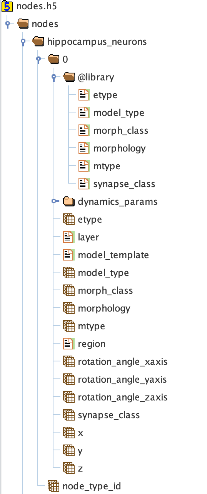

.. _sonata_tech:
.. |snap| replace:: `Blue Brain SNAP`

SONATA Technical description
============================

The following is the definition of the file format used in the SONATA file.

Sonata Files
------------

A Sonata circuit possesses multiple files which contain the different network data. This includes
at least a node file and an edge file. Each file can contain multiple populations (see below)
of nodes and edges.

At BBP, we decided to use the file extension ``.h5`` for all the sonata files. That is: the node,
edge, spike report and frame report files. This follows the official recommendations.

Even if technically possible, we decided not to mix the node and edge populations inside the same
file.

The name convention for the files outputted from ``circuit-build`` is :
  - ``nodes.h5`` for the node file
  - ``edges.h5`` for the edge file


Node File
---------

Example view of node file in a HDF viewer (might not show all possible fields):




Fields for Nodes
~~~~~~~~~~~~~~~~

It is possible to use an enumeration (enum) in the `@library` for more efficient storage use.
That should be used preferably for the fields like

- ``morphology``
- ``model_type``
- ``etype``
- ``mtype``
- ``synapse_class``
- ``morph_class``

These attributes ``/<population>/<group>/X`` have a corresponding attribute ``/<population>/<group>/@library/X`` with a limited set of `text` values.
The group ``@library`` is reserved for this purpose.

.. As per ``SONATA`` specification, these values should be stored as integer values and be resolved to strings.

The fields for the nodes depend on the model_type which has the following values `biophysical`, `virtual`, `single_compartment`, and `point_neuron`.


Fields for biophysically detailed neurons (model_type: `biophysical`)
~~~~~~~~~~~~~~~~~~~~~~~~~~~~~~~~~~~~~~~~~~~~~~~~~~~~~~~~~~~~~~~~~~~~~

For the type ``enum``, see details above.

Group column represents the HDF group where the dataset is located under /<population>. "/" means it is directly under /<population>.

.. table::

    ================== =============================== ========== ============= =========================================================================================
    Group              Field                           Type       Requirement   Description
    ================== =============================== ========== ============= =========================================================================================
    /0                 ``x``, ``y``, ``z``             float      mandatory     The position of the center of the soma in the local world in :math:`\mu m`.
    /0                 ``rotation_angle_x|y|z]axis``   float      optional      Euler angle representation of the rotation around the given axis of the morphology around the soma in radians.
    /0                 ``orientation_w|x|y|z]``        float      mandatory     Preferred way to define the rotation as quaternions.
    /0                 ``morphology``                  text       mandatory     Morphology file relative path, without file extension.Example "mymorphology" or "mypath/mymorphology". The file format may be different depending on the consumer.
    /0                 ``layer``                       text       optional?     Layer for the neuron.
    /0                 ``model_template``              enum       mandatory     See details below.
    /0                 ``model_type``                  enum       Mandatory     `biophysical`
    /0                 ``morph_class``                 enum       Mandatory     Used to define the morphology classification,. Whether they are "PYR" or "INT", for example.
    /0                 ``etype``                       enum       mandatory     Defines the electrical type of the node.
    /0                 ``mtype``                       enum       mandatory     Defines the morphological type of the node.
    /0                 ``me_combo``                    text       optional      Deprecated Replaced by dynamics_params. Foreign key to me combo tsv file.
    /0                 ``synapse_class``               enum       mandatory     Defines the synapse type of the node; whether the neuron is inhibitory or excitatory. "EXC" or "INH".
    /0                 ``region``                      enum       optional      Attribute assigning a brain region to the associated cell.
    /0/dynamics_params ``threshold_current``           float      mandatory     The minimal amplitude (in nA) of a step current clamp injection that triggers an action potential.
    /0/dynamics_params ``holding_current``             float      mandatory     The current clamp amplitude (in nA) necessary to hold the cell at a predefined holding voltage (typically around -85 mV for BBP).
    /0/dynamics_params ``AIS_scaler``                  float      optional      Multiplicative factor to scale AIS (morphology dependent and optional, used only for synthesis.
    /0                 |minis|                         float      optional      Mini-frequencies are associated with incoming connections of a cell, and depend on the incoming connection's synapse type, and the receiving cell's layer.If the synapse type is excitatory then exc-mini_frequency is used, otherwise inh-mini_frequency is used. Default to the one provided by the circuit config if not present (Unit is Hz).
    /0                 ``hemisphere``                  enum       optional      "left" or "right" hemisphere.
    /                  ``node_type_id``                integer    mandatory     Set to -1. Foreign key to node type csv file not used at BBP..
    ================== =============================== ========== ============= =========================================================================================

.. |minis| replace:: ``exc-mini_frequency``, ``inh-mini_frequency``


model_template
~~~~~~~~~~~~~~

The ``model_template`` is used to reference a template or class describing the electrophysical
properties and mechanisms of the node(s).
Its value and interpretation is context-dependent on the corresponding ‘model_type’.
When there is no applicable model template for a given model type (i.e. model_type=virtual)
it is assigned a value of NULL.
Otherwise, within BBP, it uses a colon-separated string-pair with the following syntax:

   ``hoc:resource``

where ``resource`` is a reference to the template file-name or class.


Edge File
---------

Example view of node file in a HDF viewer (might not show all possible fields):

.. image:: images/sonata_edges.png
    :align: center
    :alt: alternate text

Fields for Edges
~~~~~~~~~~~~~~~~

Fields for chemical connection type edges
~~~~~~~~~~~~~~~~~~~~~~~~~~~~~~~~~~~~~~~~~

Group column represents the HDF group where the dataset is located under /<population>. "/" means it is directly under /<population>.

.. table::

    ========= ============================= ========== =========== =========================================================================================
    Group      Field                        Type       Requirement Description
    ========= ============================= ========== =========== =========================================================================================
    /0        ``afferent_center_[x|y|z]``   float      Mandatory   Position on the `axis` of the cell's section/segment.
    /0        ```afferent_surface_[x|y|z]`` float      Mandatory   Position on the surface of a cylindrical cell segment, radially outward from the center position in the direction of the other cell.
    /0        ``afferent_section_id``       int        Mandatory   The specific section on the target node where a synapse is placed.
    /0        ``afferent_section_pos``      float      Mandatory   Fractional position along the length of the section (normalized to the range [0, 1], where 0 is at the start of the section and 1 is at the end of the section).
    /0        ``afferent_section_type``     int        Mandatory   Neurite or soma type of the afferent.
    /0        ``afferent_segment_id``       int        Mandatory   Numerical index of the section of the cell (soma is index 0).
    /0        ``afferent_segment_offset``   float      Mandatory   If triple synapse addressing is being used, the offset within the segment in um.  See :ref:`faq`.
    /0        ``efferent_center_[x|y|z]``   float      Mandatory   Same as ``afferent_center_[x|y|z]``, but for the synapse position at the axon of the presynaptic cell.
    /0        ``efferent_surface_[x|y|z]``  float      Mandatory   Same as ``efferent_center_[x|y|z]``, but the for the synapse location on the axon surface.
    /0        ``efferent_section_id``       int        Mandatory   Same as ``afferent_section_id``, but for source node.
    /0        ``efferent_section_pos``      float      Mandatory   Same as ``afferent_section_pos``, but for source node.
    /0        ``efferent_section_type``     int        Mandatory   Neurite or soma type of the afferent.
    /0        ``efferent_segment_id``       int        Mandatory   Numerical index of the section of the cell (soma is index 0).
    /0        ``efferent_segment_offset``   float      Mandatory   If triple synapse addressing is being used, the offset within the segment in um.  See :ref:`faq`.
    /0        ``conductance``               float      Mandatory   The conductance of the synapse (nanosiemens); also referred to as ``g_syn``
    /0        ``decay_time``                float      Mandatory   The decay time of the synapse (milliseconds).
    /0        ``depression_time``           float      Mandatory   The depression time constant of the synapse (milliseconds), also referred to as ``f_syn``.
    /0        ``facilitation_time``         float      Mandatory   The facilitation time constant (milliseconds) of the synapse.
    /0        ``u_syn``                     float      Mandatory   The ``u`` parameter in the `Tsodyks Markram Model`_.
    /0        ``n_rrp_vesicles``            int        Mandatory   Number of ``readily releasable pool`` of vesicles.
    /0        ``spine_length``              float      Mandatory   Distance between the two surface positions (in um).
    /0        ``conductance_scale_factor``  float      Optional    The scale factor for the conductance (no unit).If no value or negative, no change is applied.
    /0        ``u_hill_coefficient``        float      Optional    A coefficient describing the scaling of `u` to be done by the simulator. If no value, no change is applied.

                                                                   .. math::

                                                                      u_\text{final} = u \cdot y \cdot \frac{ca^4}{u_\text{Hill}^4 + ca^4}

                                                                   where :math:`ca` denotes the simulated calcium concentration in
                                                                   millimolar and :math:`y` a scalar such that at :math:`ca = 2.0:\ u_\text{final} = u`. (Markram et al., 2015)

    /0        ``syn_type_id``               int        Mandatory   The position of the rule that leads to the synapse in the recipe + 100 if it is an excitatory synapse
    /0        ``delay``                     float      Mandatory   The axonal delay (in ms, ``NaN`` for dendro-dendritic synapses).
    /         ``edge_type_id``              int        Mandatory   Links an edge to the underlying CSV file; not used at BBP.
    /         ``source_node_id``            int        Mandatory   The id of the presynaptic neuron.
    /         ``target_node_id``            int        Mandatory   The id of the postsynaptic neuron.
    ========= ============================= ========== =========== =========================================================================================


Fields for electrical_synapse connection type edges
~~~~~~~~~~~~~~~~~~~~~~~~~~~~~~~~~~~~~~~~~~~~~~~~~~~

to be completed.

.. table::

    =============================  ========== =========================================================================================
    Field                          Type        Description
    =============================  ========== =========================================================================================
    ``junction_id_pre``            int        TBD
    ``junction_id_post``           int        TBD
    =============================  ========== =========================================================================================

Fields for synapse_astrocyte connection type edges
~~~~~~~~~~~~~~~~~~~~~~~~~~~~~~~~~~~~~~~~~~~~~~~~~~

- ``source_node_id`` the node id of the astrocyte
- ``target_node_id`` the node id of the post synaptic neuron
- ``efferent_section_id`` the astrocyte section id
- ``efferent_section_pos`` the position along the length of the efferent section of the astrocyte (normalized to the range [0, 1], where 0 is at the start of the section and 1 is at the end of the section)

Fields for endfoot connection type edges
~~~~~~~~~~~~~~~~~~~~~~~~~~~~~~~~~~~~~~~~

- ``source_node_id`` the node id of the astrocyte
- ``target_node_id`` the node id of the vasculature
- ``efferent_section_id`` the astrocyte section id
- ``efferent_section_pos`` the position along the length of the efferent section of the cell (normalized to the range [0, 1], where 0 is at the start of the section and 1 is at the end of the section)
- ``afferent_section_id`` the vasculature section id
- ``afferent_section_pos`` the position along the length of the afferent section of the vasculature (normalized to the range [0, 1], where 0 is at the start of the section and 1 is at the end of the section)


Consumers
---------

Consumers use the sonata ``.h5`` files, and depending on the tool the required fields are different.

TouchDetector
~~~~~~~~~~~~~

Required fields for ``TouchDetector``:
   - ``x``, ``y``, ``z``
   - ``orientation_w``, ``orientation_x``, ``orientation_y``, ``orientation_z``
   - ``morphology``
   - ``region``
   - ``mtype``

Spykfunc
~~~~~~~~

Required fields for ``Spykfunc``:
   - ``morphology``
   - ``etype``
   - ``mtype``
   - ``synapse_class``

.. _specification: https://github.com/AllenInstitute/sonata/blob/master/docs/SONATA_DEVELOPER_GUIDE.md
.. _enumeration: https://github.com/AllenInstitute/sonata/blob/master/docs/SONATA_DEVELOPER_GUIDE.md#nodes---enum-datatypes
.. _Tsodyks Markram Model: https://www.pnas.org/content/94/2/719
