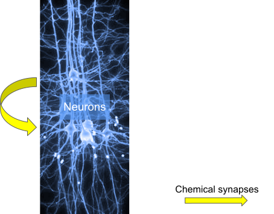

:orphan:

usecase 1
=========

This usecase 1 is 1 population of biophysical neurons with chemical synapses between neurons of that population

circuit configuration
---------------------
.. include:: usecases/usecase1/circuit_sonata.json
   :literal:

node files
----------

.. include:: usecases/usecase1/nodes.h5.txt
   :literal:

edge files
----------

.. include:: usecases/usecase1/edges.h5.txt
   :literal:

reports
-------

simulation config used (report section only)

.. include:: usecases/usecase1/simulation_sonata.json
   :literal:

spike report
^^^^^^^^^^^^

.. include:: usecases/usecase1/reporting/spikes.h5.txt
   :literal:

soma report
^^^^^^^^^^^

.. include:: usecases/usecase1/reporting/soma_report.h5.txt
   :literal:

compartment report
^^^^^^^^^^^^^^^^^^

.. include:: usecases/usecase1/reporting/compartment_report.h5.txt
   :literal:
