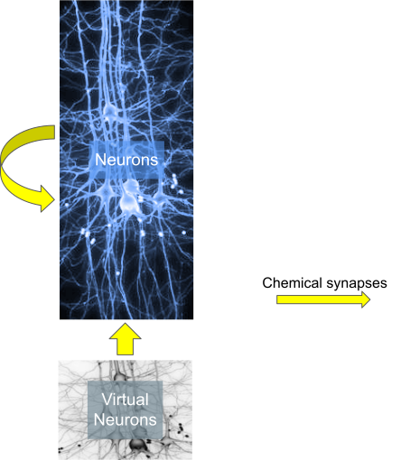

:orphan:

usecase 2
=========

This usecase 2 is 1 population of biophysical neurons with chemical synapses between neurons of that population and 1 virtual node population projecting into the biophysical neurons.
In this usecase, virtual and biophysical nodes are in the same node files as opposed to usecase4.

circuit configuration
---------------------
.. include:: usecases/usecase2/circuit_sonata.json
   :literal:

node files
----------

biophysical nodes and virtual nodes
^^^^^^^^^^^^^^^^^^^^^^^^^^^^^^^^^^^

.. include:: usecases/usecase2/nodes.h5.txt
   :literal:

edge files
----------

edges between the biophysical neurons
^^^^^^^^^^^^^^^^^^^^^^^^^^^^^^^^^^^^^

.. include:: usecases/usecase2/edges.h5.txt
   :literal:

projections to the biophysical neurons
^^^^^^^^^^^^^^^^^^^^^^^^^^^^^^^^^^^^^^

.. include:: usecases/usecase2/projections.h5.txt
   :literal:

reports
-------

simulation config used (report section only)

.. include:: usecases/usecase2/simulation_sonata.json
   :literal:

spike report
^^^^^^^^^^^^

.. include:: usecases/usecase2/reporting/spikes.h5.txt
   :literal:

soma report
^^^^^^^^^^^

.. include:: usecases/usecase2/reporting/soma_report.h5.txt
   :literal:

compartment report
^^^^^^^^^^^^^^^^^^

.. include:: usecases/usecase2/reporting/compartment_report.h5.txt
   :literal:
