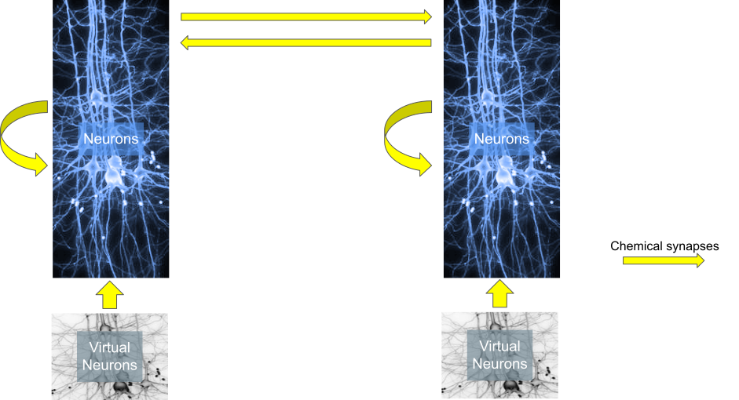

:orphan:

usecase 4
=========

This usecase 4 is 2 populations of biophysical neurons with chemical synapses between neurons of their population and the other population and 2 virtual node populations projecting each in 1 different population.

circuit configuration
---------------------
.. include:: usecases/usecase4/circuit_sonata.json
   :literal:

node files
----------

node population A
^^^^^^^^^^^^^^^^^

.. include:: usecases/usecase4/nodes_A.h5.txt
   :literal:

node population B
^^^^^^^^^^^^^^^^^

.. include:: usecases/usecase4/nodes_B.h5.txt
   :literal:

virtual nodes projecting to A
^^^^^^^^^^^^^^^^^^^^^^^^^^^^^

.. include:: usecases/usecase4/virtual_nodes_A.h5.txt
   :literal:

virtual nodes projecting to B
^^^^^^^^^^^^^^^^^^^^^^^^^^^^^

.. include:: usecases/usecase4/virtual_nodes_B.h5.txt
   :literal:

edge files
----------

edges between the biophysical neurons of nodes_A
^^^^^^^^^^^^^^^^^^^^^^^^^^^^^^^^^^^^^^^^^^^^^^^^

.. include:: usecases/usecase4/local_edges_A.h5.txt
   :literal:

edges between the biophysical neurons of nodes_B
^^^^^^^^^^^^^^^^^^^^^^^^^^^^^^^^^^^^^^^^^^^^^^^^

.. include:: usecases/usecase4/local_edges_B.h5.txt
   :literal:

edges between the 2 populations A and B
^^^^^^^^^^^^^^^^^^^^^^^^^^^^^^^^^^^^^^^^

.. include:: usecases/usecase4/edges_AB.h5.txt
   :literal:

projections to population A
^^^^^^^^^^^^^^^^^^^^^^^^^^^

.. include:: usecases/usecase4/projections_A.h5.txt
   :literal:

projections to population B
^^^^^^^^^^^^^^^^^^^^^^^^^^^

.. include:: usecases/usecase4/projections_B.h5.txt
   :literal:

reports
-------

simulation config used (report section only)

.. include:: usecases/usecase4/simulation_sonata.json
   :literal:

spike report
^^^^^^^^^^^^

.. include:: usecases/usecase4/reporting/spikes.h5.txt
   :literal:

soma report
^^^^^^^^^^^

.. include:: usecases/usecase4/reporting/soma_report.h5.txt
   :literal:

compartment report
^^^^^^^^^^^^^^^^^^

.. include:: usecases/usecase4/reporting/compartment_report.h5.txt
   :literal:
