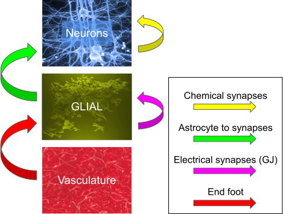

:orphan:

usecase 5
=========

This usecase is 1 population of neurons, 1 population of glial, 1 population of vasculature with:

- chemical synapses between neurons
- astrocyte to synapse from glial to neurons
- electrical synapses between glial cells
- end foot from vasculature to glial

circuit configuration
---------------------
.. include:: usecases/usecase5/circuit_sonata.json
   :literal:

node files
----------

biophysical neuron population
^^^^^^^^^^^^^^^^^^^^^^^^^^^^^

.. include:: usecases/usecase5/nodes.h5.txt
   :literal:

glial population
^^^^^^^^^^^^^^^^

.. include:: usecases/usecase5/astrocytes.h5.txt
   :literal:

vasculature population
^^^^^^^^^^^^^^^^^^^^^^

.. include:: usecases/usecase5/vasculature.h5.txt
   :literal:

edge files
----------

chemical synapses between the biophysical neurons
^^^^^^^^^^^^^^^^^^^^^^^^^^^^^^^^^^^^^^^^^^^^^^^^^

.. include:: usecases/usecase5/edges.h5.txt
   :literal:

astrocytes to synapses connections
^^^^^^^^^^^^^^^^^^^^^^^^^^^^^^^^^^

.. include:: usecases/usecase5/neuroglial.h5.txt
   :literal:

electrical synapses between glial cells
^^^^^^^^^^^^^^^^^^^^^^^^^^^^^^^^^^^^^^^

.. include:: usecases/usecase5/glialglial.h5.txt
   :literal:

endfoot connections
^^^^^^^^^^^^^^^^^^^

.. include:: usecases/usecase5/gliovascular.h5.txt
   :literal:

end_feet area
-------------

.. include:: usecases/usecase5/endfeet_areas.h5.txt
   :literal:
